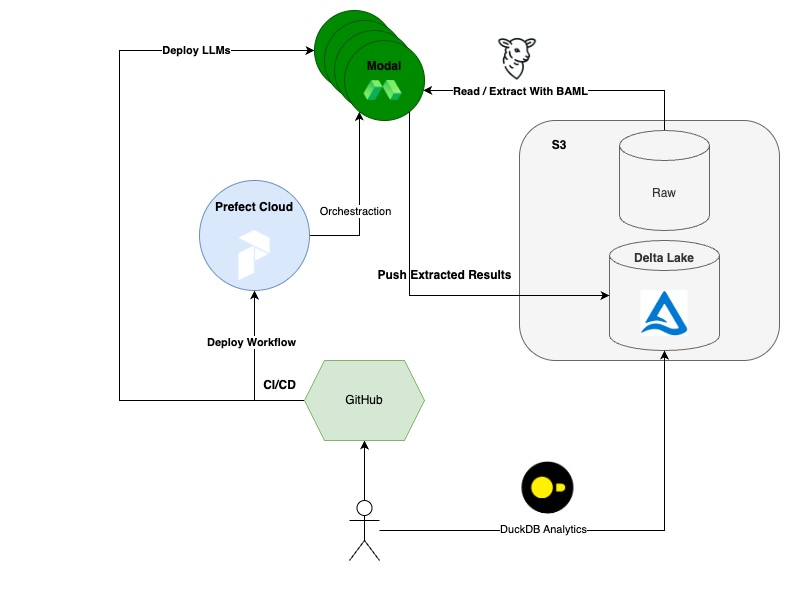
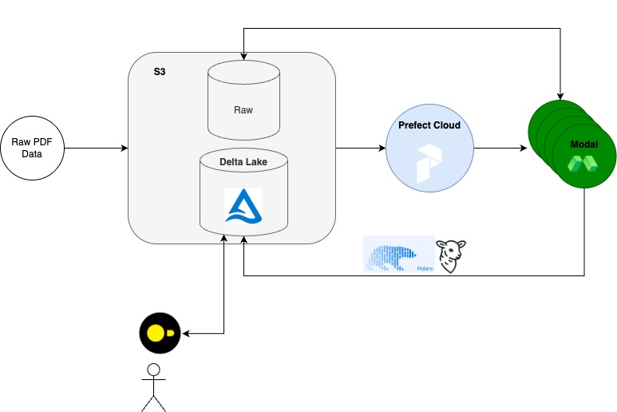

# Extract Anything

Adapted from https://github.com/BoundaryML/baml-examples/tree/hellovai/extract-anything

A ready-to-go repo for building complex extraction systems:
* BAML for bulletproof LLM extractions with type-safe outputs
* Prefect for orchestrating extraction jobs from raw PDF -> extraction -> Delta table for analytics
* Modal for compute of prefect jobs + deploying open source LLMs for processing
* Delta lake for storing extracted results for downstream analytics and data processing
* GitHub CI/CD

## Full CI/CD workflows

### Infrastructure

### Dataflow

This repo comes equipt to run prefect jobs on modal, processing raw documents with baml. To configure prefect and modal, follow [this guide](https://docs.prefect.io/v3/deploy/infrastructure-examples/modal). See the Makefile for some helpful aliases.

## Required repo secrets
* `MODAL_TOKEN_ID`: https://modal.com/settings/[YOUR_ACCOUNT]/member-tokens
* `MODAL_TOKEN_SECRET`: https://modal.com/settings/[YOUR_ACCOUNT]/member-tokens
* `SLACK_BOT_TOKEN`: https://api.slack.com/tutorials/tracks/getting-a-token 
* `PREFECT_API_KEY`: See the output of `make show-prefect-profile` (after running `make prefect-auth`)
* `PREFECT_API_URL`: See the output of `make show-prefect-profile` (after running `make prefect-auth`)

## Requred .env values
This depends on what LLM you're using. If OpenAI, then the standard OPENAI_API_KEY, if vertex, then the path to your vertex-json credentials.
If you are using LLMs deployed in modal, you need to set `LLM_BASE_URL`

See the `.env.example` for examples.

"""
SELECT 
    n.agreement_type,
    COUNT(*) AS total_agreements,
    ROUND(AVG(n.confidentiality_period_length), 2) AS avg_confidentiality_period,
    COUNT(CASE WHEN r.severity = 'HIGH' THEN 1 END) AS high_risk_count,
    COUNT(DISTINCT r.nda_id) AS agreements_with_risks,
    ROUND(COUNT(CASE WHEN r.severity = 'HIGH' THEN 1 END) * 100.0 / COUNT(*), 2) AS high_risk_percentage
FROM 
    ndas n
LEFT JOIN 
    risks r ON n.nda_id = r.nda_id
GROUP BY 
    n.agreement_type
ORDER BY 
    high_risk_percentage DESC;

CREATE OR REPLACE VIEW train_services AS SELECT * FROM delta_scan('gs://northeastern-pdf-ndas/db/train_services');

select * from train_services;
"""